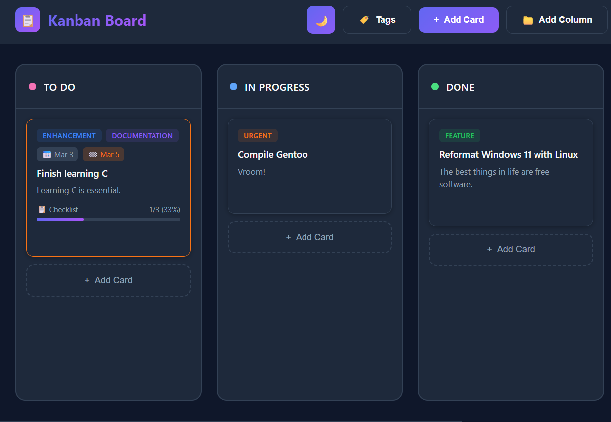

# Kanban Board

A feature-rich, single-file Kanban board application with your choice of PowerShell or Python backend. Perfect for teams sharing a network drive or for personal task management.



## Features

### Core Functionality
- **Drag & Drop** - Move cards between columns and reorder them effortlessly
- **Column Management** - Create, rename, delete, and reorder columns
- **Card Management** - Full CRUD operations with rich card details
- **Tags** - Color-coded labels for categorizing and filtering cards
- **Checklists** - Add task lists to cards with completion tracking
- **Date Ranges** - Set start and end dates with a visual calendar picker
- **Theme Toggle** - Light and dark mode with preference persistence

### Technical Features
- **Dual Backend** - Choose between PowerShell or Python servers
- **JSON Storage** - Simple, portable data storage (`kanban_data.json`)
- **Network Sharing** - Share the board across your local network when running as admin
- **Single-File Frontend** - Everything in one `index.html` file
- **No Dependencies** - Python uses only standard library; PowerShell uses built-in cmdlets

## Quick Start

### Option 1: Batch File (Windows)
Double-click `Start Kanban.bat` to launch. You'll be prompted to run as Administrator for network access.

### Option 2: PowerShell
```powershell
powershell.exe -ExecutionPolicy Bypass -File server.ps1
```

### Option 3: Python
```bash
python server.py
```

Then open your browser to:
- **Local**: http://127.0.0.1:8080
- **Network**: http://YOUR_HOSTNAME:8080 (when running as admin)

## File Structure

```
kanban/
├── index.html          # Frontend (single file with embedded CSS/JS)
├── server.ps1          # PowerShell backend server
├── server.py           # Python backend server
├── kanban_data.json    # Data storage (auto-created)
├── Start Kanban.bat    # Windows launcher script
└── README.md           # This file
```

## Network Access

When launched as Administrator, the server binds to all network interfaces, allowing other users on your network to access the board.

**Example output when running as admin:**
```
========================================
Kanban Board Server is now running!
========================================
Running as Administrator - accessible over network
Local access:   http://127.0.0.1:8080
Hostname:       http://DESKTOP-ABC123:8080
Network access: http://192.168.1.100:8080
========================================
```

## API Reference

Both backends implement the same REST API:

### Cards
| Method | Endpoint | Description |
|--------|----------|-------------|
| GET | `/api/cards` | Get all cards |
| GET | `/api/cards/{id}` | Get a single card |
| POST | `/api/cards` | Create a new card |
| PUT | `/api/cards/{id}` | Update a card |
| DELETE | `/api/cards/{id}` | Delete a card |
| PUT | `/api/reorder` | Reorder cards after drag |
| PUT | `/api/cards/bulk-move` | Move card to new column/position |

### Columns
| Method | Endpoint | Description |
|--------|----------|-------------|
| GET | `/api/columns` | Get all columns |
| POST | `/api/columns` | Create a new column |
| PUT | `/api/columns/{id}` | Update a column |
| DELETE | `/api/columns/{id}` | Delete a column (must be empty) |
| PUT | `/api/columns/reorder` | Reorder columns |
| PUT | `/api/columns/move-cards` | Move all cards between columns |

### Tags
| Method | Endpoint | Description |
|--------|----------|-------------|
| GET | `/api/tags` | Get all tags |
| POST | `/api/tags` | Create a new tag |
| DELETE | `/api/tags/{id}` | Delete a tag |

### Checklists
| Method | Endpoint | Description |
|--------|----------|-------------|
| POST | `/api/cards/{id}/checklist` | Add checklist item |
| PUT | `/api/checklist/{id}` | Update checklist item |
| DELETE | `/api/checklist/{id}` | Delete checklist item |

## Data Format

Data is stored in `kanban_data.json`:

```json
{
  "columns": [
    { "id": "todo", "name": "To Do", "position": 0, "color": "#f472b6" }
  ],
  "tags": [
    { "id": 1, "name": "Bug", "color": "#ef4444" }
  ],
  "cards": {
    "1": {
      "id": "1",
      "title": "Task name",
      "description": "Task description",
      "column": "todo",
      "position": 0,
      "start_date": "2024-01-01",
      "end_date": "2024-01-15",
      "created_at": "2024-01-01 10:00:00",
      "tags": [1, 2],
      "checklist": [
        { "id": 1, "text": "Subtask", "completed": false, "position": 0 }
      ]
    }
  },
  "nextCardId": 2,
  "nextTagId": 6
}
```

## Security Features

- **XSS Protection** - Frontend HTML escaping on all user text (titles, descriptions, tag names)
- **Color Validation** - Server-side validation (hex and RGB formats only)
- **Security Headers** - X-Content-Type-Options, X-Frame-Options, X-XSS-Protection
- **CORS Enabled** - API accessible from any origin
- **Admin-Only Network Binding** - Server binds to localhost only unless running as admin

## Customization

### Change Port
Edit the `$Port` variable in `server.ps1` or modify the `run(port=8080)` call in `server.py`.

### Default Data
Modify the `get_default_data()` function in `server.py` or `Initialize-DefaultData` in `server.ps1`.

## Requirements

- **PowerShell**: Windows PowerShell 5.1 or PowerShell 7+
- **Python**: Python 3.6+ (no external packages required)

## License

MIT License - Feel free to use and modify for your needs.

## Contributing

Contributions welcome! Please ensure any changes work with both backend implementations.